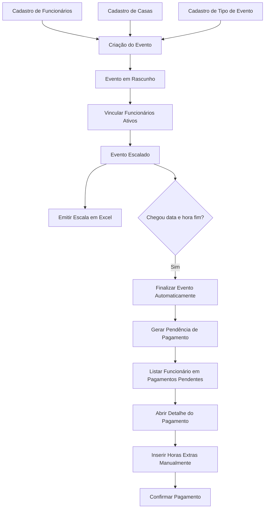
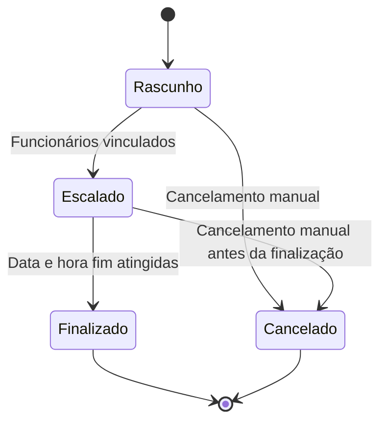
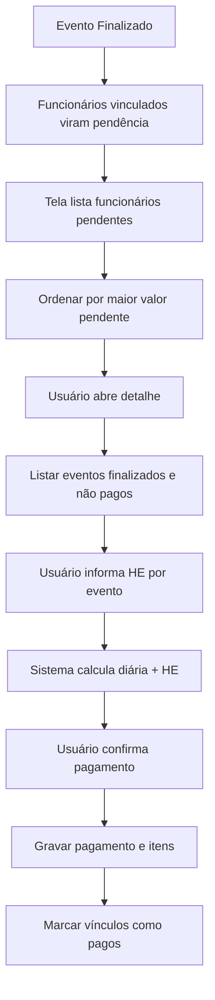

# Fluxos do Sistema — TAG

## Fluxo operacional principal

```mermaid
flowchart TD
    A[Cadastro de Funcionários] --> D[Criação do Evento]
    B[Cadastro de Casas] --> D
    C[Cadastro de Tipo de Evento] --> D
    D --> E[Evento em Rascunho]
    E --> F[Vincular Funcionários Ativos]
    F --> G[Evento Escalado]
    G --> H[Emitir Escala em Excel]
    G --> I{Chegou data e hora fim?}
    I -- Sim --> J[Finalizar Evento Automaticamente]
    J --> K[Gerar Pendência de Pagamento]
    K --> L[Listar Funcionário em Pagamentos Pendentes]
    L --> M[Abrir Detalhe do Pagamento]
    M --> N[Inserir Horas Extras Manualmente]
    N --> O[Confirmar Pagamento]
```

## Status do evento

```mermaid
stateDiagram-v2
    [*] --> Rascunho
    Rascunho --> Escalado: Funcionários vinculados
    Rascunho --> Cancelado: Cancelamento manual
    Escalado --> Cancelado: Cancelamento manual antes da finalização
    Escalado --> Finalizado: Data e hora fim atingidas
    Finalizado --> [*]
    Cancelado --> [*]
```

## Pagamento

```mermaid
flowchart TD
    A[Evento Finalizado] --> B[Funcionários vinculados viram pendência]
    B --> C[Tela lista funcionários pendentes]
    C --> D[Ordenar por maior valor pendente]
    D --> E[Usuário abre detalhe]
    E --> F[Listar eventos finalizados e não pagos]
    F --> G[Usuário informa HE por evento]
    G --> H[Sistema calcula diária + HE]
    H --> I[Usuário confirma pagamento]
    I --> J[Gravar pagamento e itens]
    J --> K[Marcar vínculos como pagos]
```
