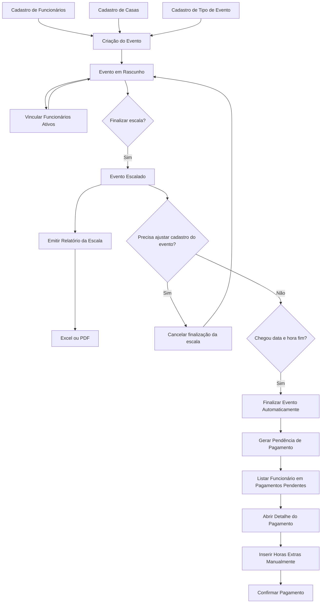
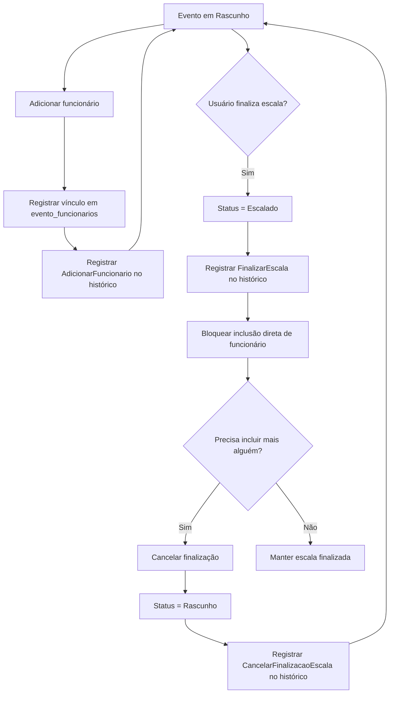
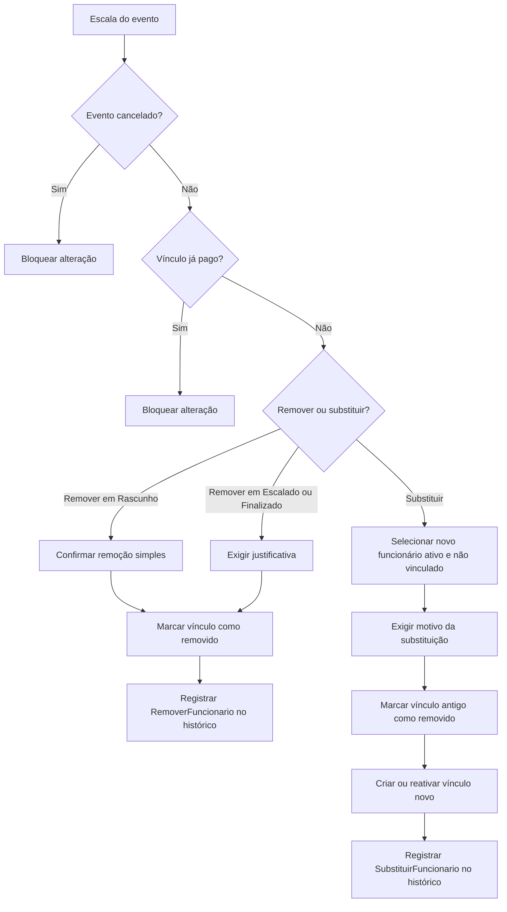
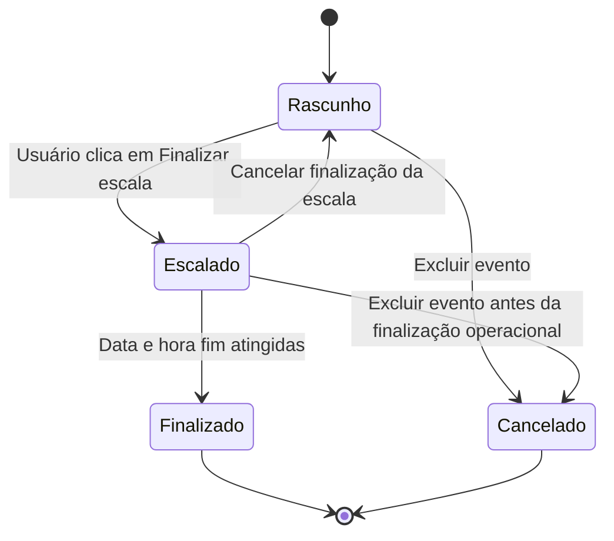
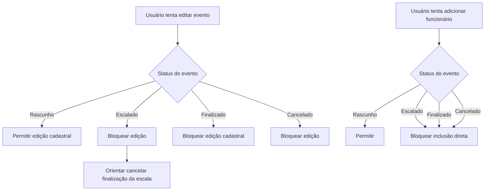
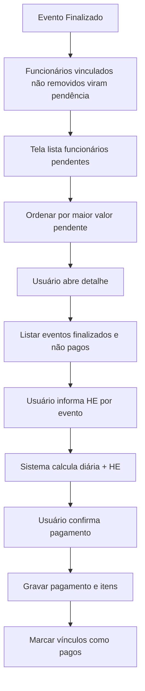

# Fluxos do Sistema — TAG

## Fluxo operacional principal

## Fluxo de escala do evento

## Substituição e remoção de funcionário

## Status do evento

## Regras de bloqueio na operação

## Pagamento

