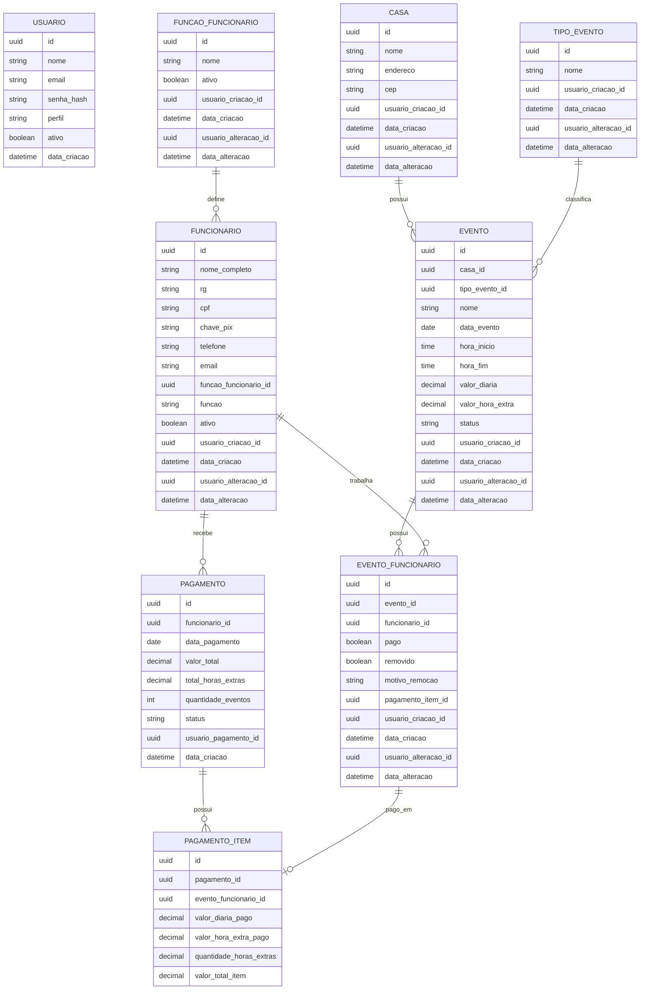

# Modelo Entidade-Relacionamento — Sistema TAG

## Observação sobre funções de funcionário

A entidade `FUNCAO_FUNCIONARIO` é um cadastro mestre usado para alimentar o campo `funcao` do cadastro de funcionários no frontend.

O relacionamento é feito por `FUNCIONARIO.funcao_funcionario_id -> FUNCAO_FUNCIONARIO.id`. O campo textual `FUNCIONARIO.funcao` permanece como valor desnormalizado para compatibilidade visual e relatórios.
