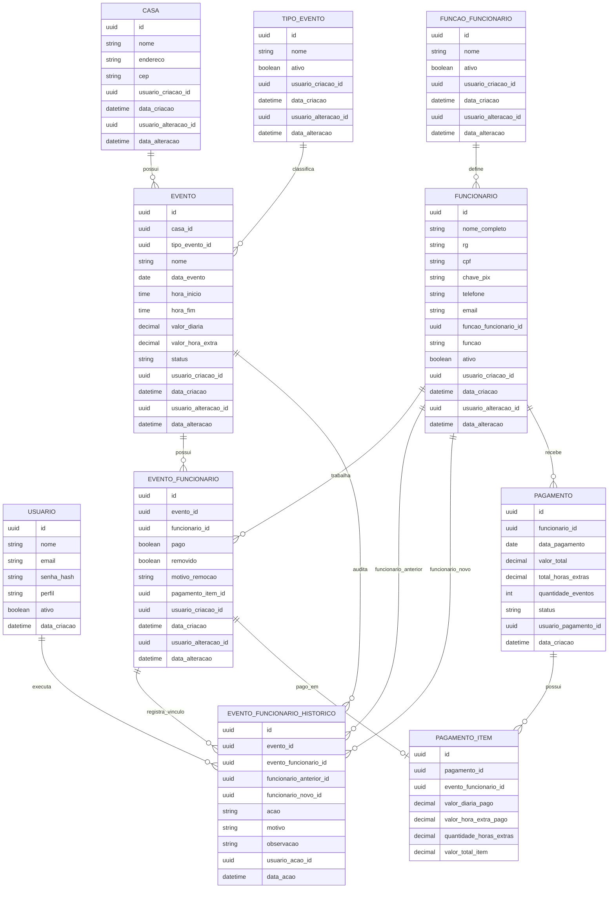

# Modelo Entidade-Relacionamento — Sistema TAG

## Observação sobre funções de funcionário

A entidade `FUNCAO_FUNCIONARIO` é um cadastro mestre usado para alimentar o campo `funcao` do cadastro de funcionários no frontend.

O relacionamento é feito por `FUNCIONARIO.funcao_funcionario_id -> FUNCAO_FUNCIONARIO.id`. O campo textual `FUNCIONARIO.funcao` permanece como valor desnormalizado para compatibilidade visual e relatórios.

## Observação sobre escala e auditoria operacional

A tabela `EVENTO_FUNCIONARIO` representa o estado atual da escala do evento: funcionário vinculado, removido ou pago.

A tabela `EVENTO_FUNCIONARIO_HISTORICO` registra a trilha operacional das alterações feitas na escala. Ela não substitui o vínculo atual; serve para rastrear ações futuras em relatórios e auditorias.

Ações previstas no histórico:

- `AdicionarFuncionario`
- `ReativarFuncionario`
- `RemoverFuncionario`
- `SubstituirFuncionario`
- `FinalizarEscala`
- `CancelarFinalizacaoEscala`

Campos principais do histórico:

- `evento_id`: evento afetado;
- `evento_funcionario_id`: vínculo afetado, quando existir;
- `funcionario_anterior_id`: funcionário removido ou substituído;
- `funcionario_novo_id`: funcionário adicionado, reativado ou substituto;
- `acao`: tipo da operação realizada;
- `motivo`: justificativa operacional, quando exigida;
- `usuario_acao_id`: usuário que executou a ação;
- `data_acao`: data/hora da ação.

## Status operacional do evento

Status atuais de evento:

- `Rascunho`: evento criado e ainda editável; permite montar a escala.
- `Escalado`: escala finalizada pelo usuário; bloqueia edição cadastral do evento e inclusão direta de novos funcionários.
- `Finalizado`: evento encerrado operacionalmente; não permite edição cadastral nem cancelamento, mas ainda permite ajustes justificados na escala enquanto houver vínculos não pagos.
- `Cancelado`: evento excluído/cancelado operacionalmente; não aparece na listagem de operação.
